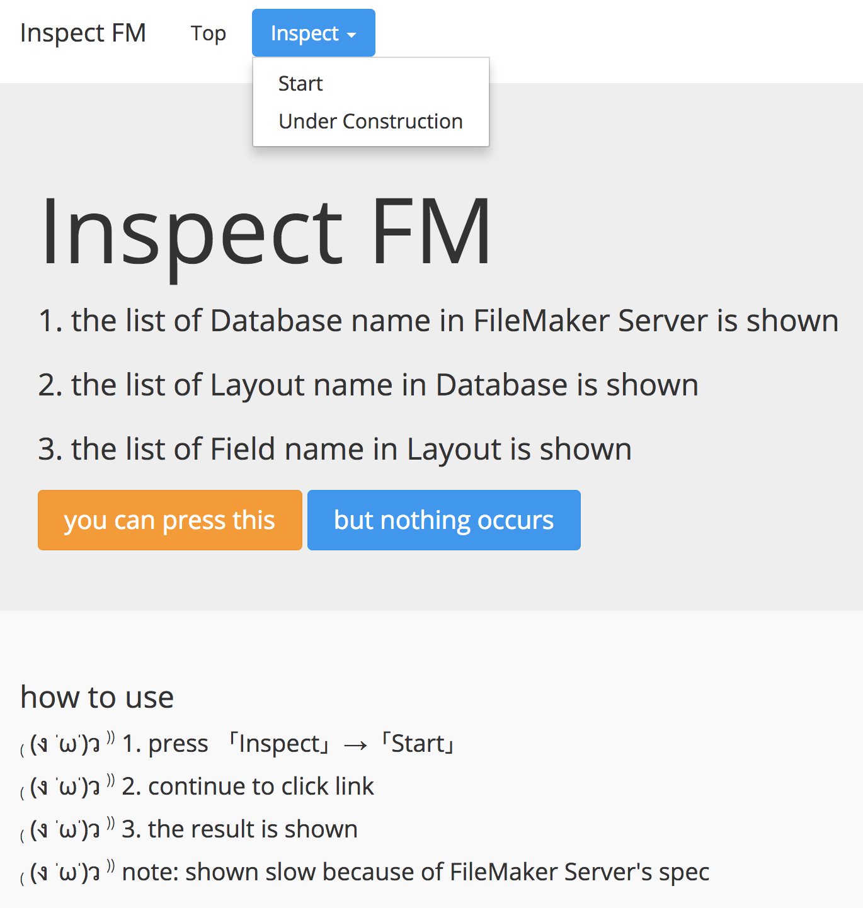

[](https://circleci.com/gh/corselia/inspect-fm)

# Inspect FM
- show the below list in `FileMaker Server`
    - Database Name
    - Layout Name in Database
    - Field Name in Layout

# Screenshot


# Prepare
- set your FileMaker config in [`config/filemaker.yml`](/config/filemaker.yml)
- install gems

```bash
$ bundle install --path vendor/bundle
```

# Start

```bash
$ bundle exec unicorn -c unicorn.conf -p 4567 -D
```

# Access
- access to `http://localhost:4567` and you can use this app!

# Gem
- [mech/filemaker-ruby](https://github.com/mech/filemaker-ruby)

# Powered by
- [Sinatra](http://www.sinatrarb.com/)
- [Honoka](http://honokak.osaka/)
- [Capistrano](http://capistranorb.com/)

# Note
- the target names of each element (Database, Layout and Field) aren't shown when your account doesn't have the authentication
- how to stop unicorn
    - note: use **back quote** for cat command

```bash
$ kill -QUIT `cat /tmp/unicorn.inspect-fm.pid`
```

- Japanese Instruction at Qiita
    - [FileMaker Server 内の「データベース名」、「レイアウト名」、「フィールド名」を表示できるウェブアプリケーションを作った \- Qiita](https://qiita.com/corselia/items/cae878f0c94fa990402e)

# LICENSE
[MIT LICENSE](/LICENSE)
